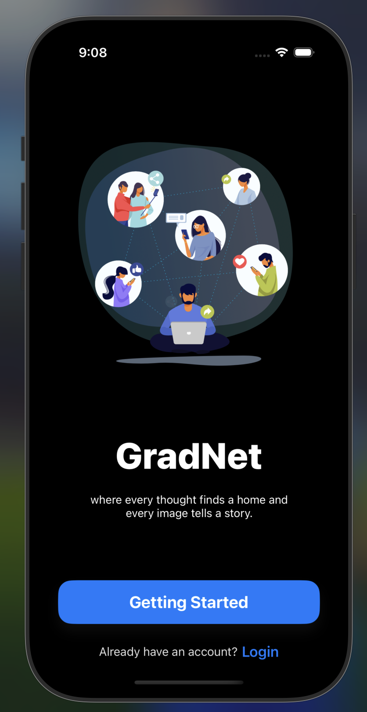
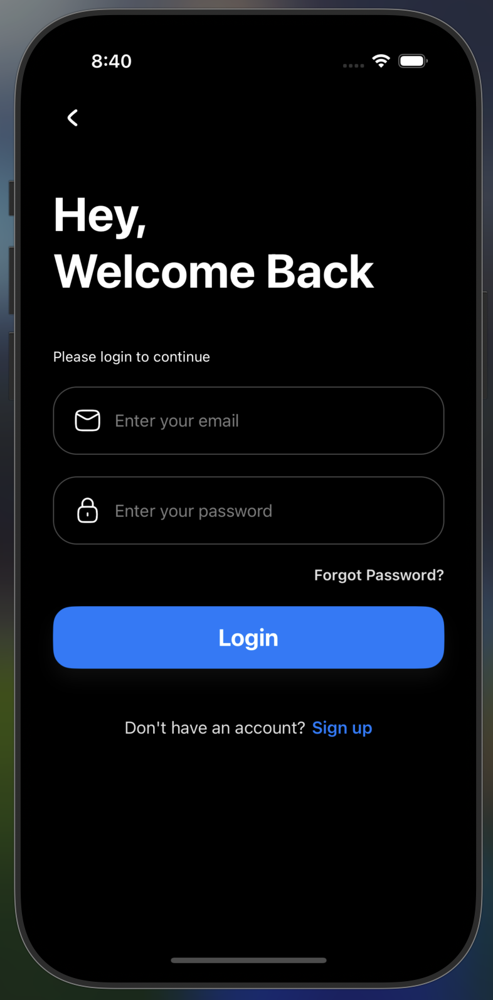
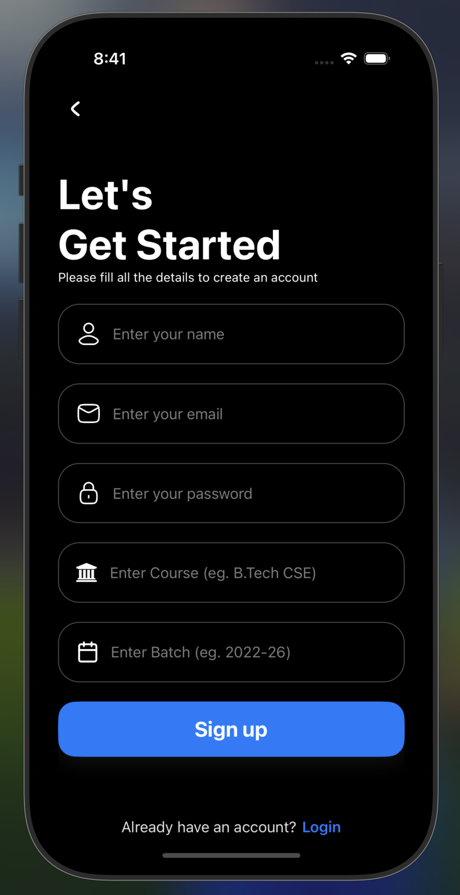
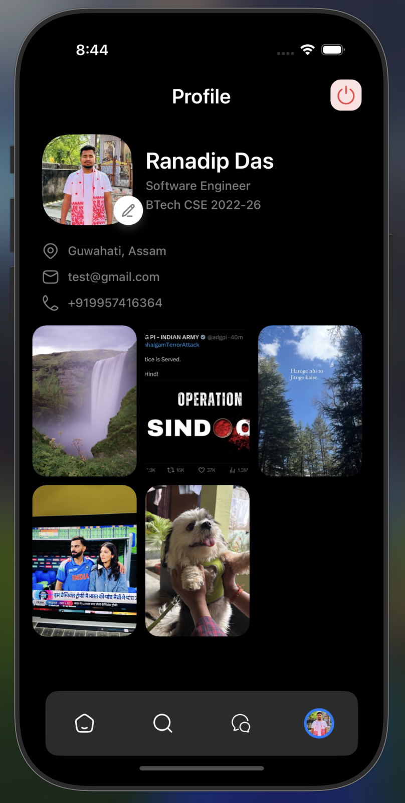
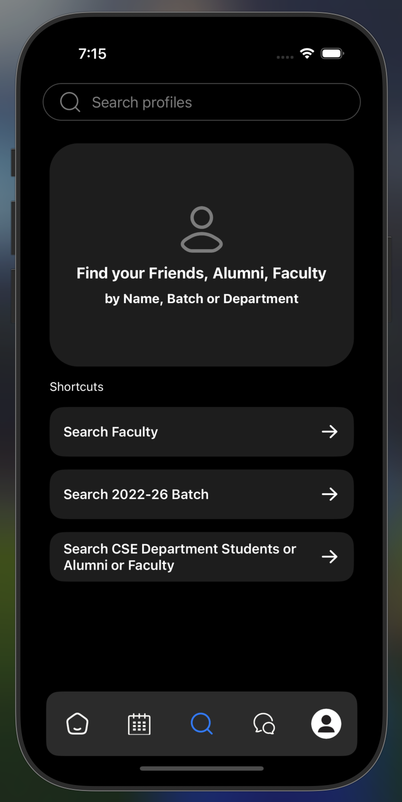
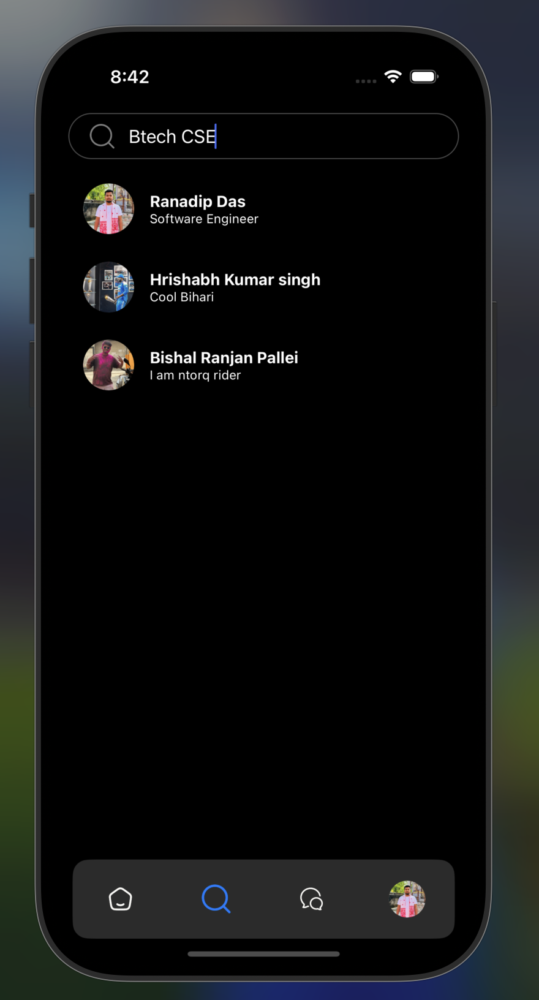
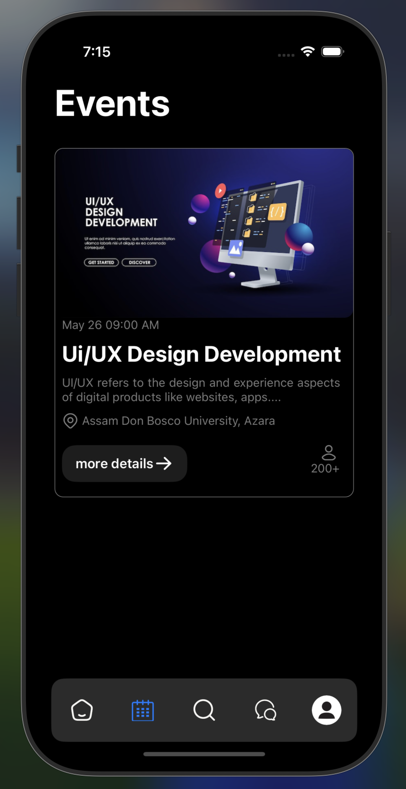
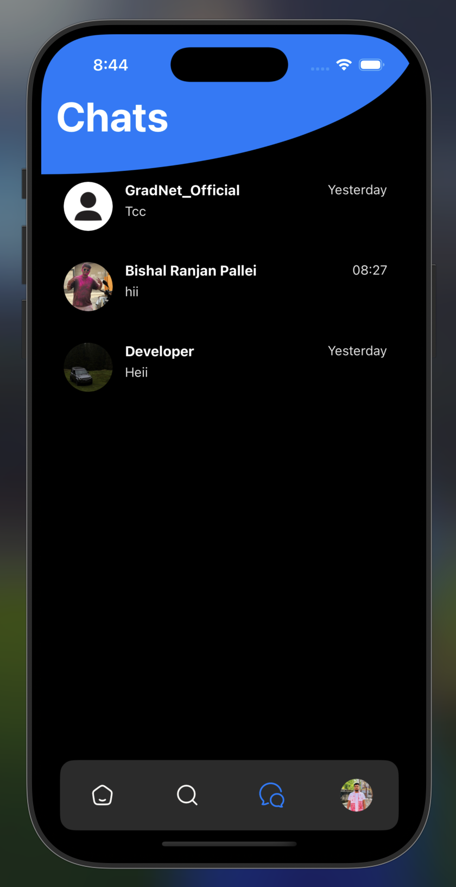
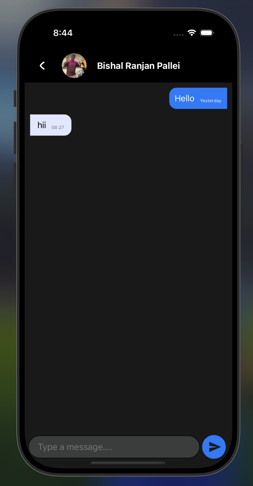

# 🎓 Alumni Network App

A **React Native** application designed to bridge the gap between **current students**, **alumni**, and **faculty** of a university.
This app creates a centralized, user-friendly platform to foster mentorship, career guidance, professional networking, and meaningful connections.

---

## 🚀 Features

✅ **For Students**

* Explore alumni profiles
* Send connection requests
* Gain insights into alumni career paths and achievements
* Join alumni batches for networking

✅ **For Alumni**

* Connect with fellow alumni
* View current student batches
* Offer mentorship and career guidance
* Participate in events and knowledge-sharing

✅ **For Faculty**

* Oversee interactions between students and alumni
* Manage and moderate the platform
* Ensure a healthy and collaborative environment

✅ **General**

* Centralized alumni data management
* Creation and management of alumni batches
* Easy-to-navigate UI/UX
* Secure login and authentication

---

## 🛠️ Tech Stack

* **Frontend**: React Native (Expo)
* **Backend**: \[Node.js, ExpressJs]
* **Database**: \[Firebase, MongoDB, Supabase]
* **Authentication**: \[Supabase Auth]
* **State Management**: \[Redux, Context API]

---

## 📱 Screenshots

### Welcome Screen


### Login Screen


### Sign up Screen


### Home Screen


### Home Screen
[](./assets/screenshots/home.png)

### Profile Screen


### Search Screen




### Events Screen


### Chat Screen


### Chat Room Screen


---

## 🏦 Installation

1️⃣ **Clone the repository**

```bash
git clone https://github.com/your-username/alumni-network-app.git
cd alumni-network-app
```

2️⃣ **Install dependencies**

```bash
npm install
```

3️⃣ **Start the app**

```bash
npx expo start
```

---

## 🏐 Project Structure

```
/src
  /components
  /screens
  /navigation
  /services
  /contexts
  /assets
App.js
```

---

## 🌐 Planned Features (Future Work)

* Smart mentorship matching
* Job and internship board
* Alumni business marketplace
* Alumni events with RSVP
* Alumni map (global view)
* Resource exchange and time capsule posts

---

## 🤝 Contributing

We welcome contributions!
Please follow these steps:

1. Fork the repository
2. Create a new branch (`git checkout -b feature/YourFeature`)
3. Commit your changes (`git commit -m 'Add your message here'`)
4. Push to the branch (`git push origin feature/YourFeature`)
5. Open a Pull Request

---

## 📄 License

---

## 💬 Contact

For questions or collaboration:

* **Ranadip Das** — \[ranadipdas07@gmail.com]

---

⭐ **If you like this project, don’t forget to give it a star!**
